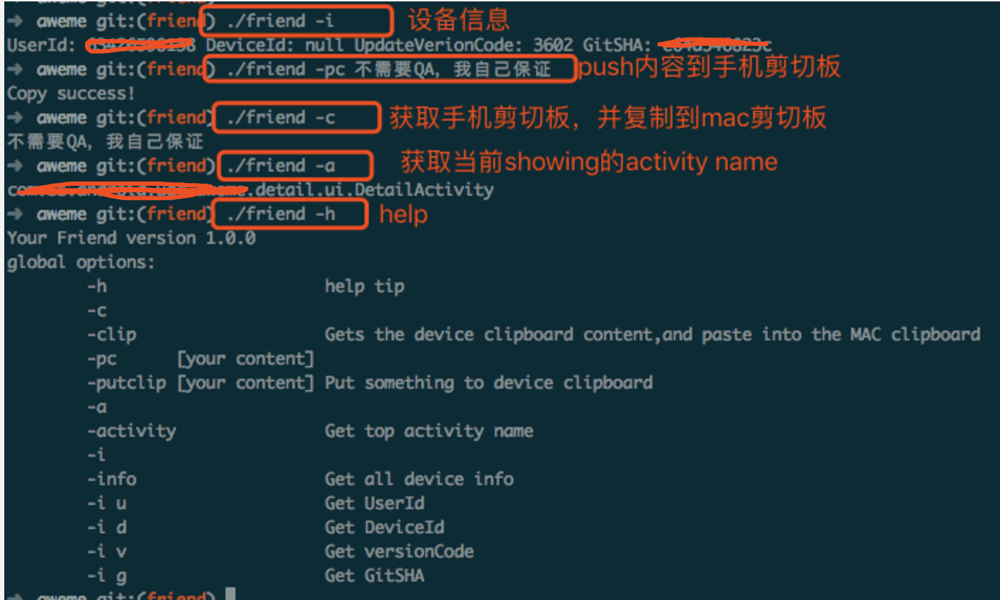

# Crony - FriendsTool

Crony - FriendTools 是一个shell脚本， 初衷皆在于通过你简单的脚本命令，帮助你快速简单的解决开发过程中和测试机的信息交换问题。
## 前言

如果你在日常开发中遇到过以下问题，那FriendTools一定是你的好朋友。

- 一个字一个字的盯着手机上的 DeviceId, UserId 输到电脑上~
- 获取一台或多台陌生的测试机 DeviceId，UserId等信息
- 不熟悉代码的情况下，通过多步操作找到当前正在展示的 Activity 类名
- 盯着电脑，一个字一个字的在测试机输入 IP、URL、手机号等
- 在测试机上安装 微信等IM软件，只为了可以复制信息在测试机和电脑之间传输
- 重写某个按钮 Click 事件，只为了临时测试某段代码

FriendTools 是一个shell脚本， 初衷皆在于通过你简单的脚本命令，帮助你快速简单的解决以上问题。

## Friend Tools Usage

暂仅支持Mac

在 app 目录的build.gradle添加：

	dependencies {
	    compile 'com.github.zhaoxuan:1.0.1'
	}

实现 IGetInfo 接口

```
public class GetInfo implements IGetInfo {

    @Override
    public String getInfo(String key) {
        switch (key) {
            case "":
                return "userID: 9999339 \n deviceId: asdwoekaksd";
            case "user":
                return "userID: 9999339 ";
            case "info":
                return "userID: 9999339 \n deviceId: asdwoekaksd";
            case "c1":
                //执行某段自定义代码
                Log.d("TAG","自定义代码");
                return "ok";
            default:
                return "don't support key";
        }
    }
}

```

初始化 CronyManager

```
CronyManager.init(application);
CronyManager.setIGetInfo(new GetInfo());
```

**run app**

terminal cd 到 aweme 根目录

	➜ cd aweme/

查看 FriendTools 指令帮助

	➜ ./friends

获取当前正在运行的activity类名

	➜ ./friends -a
	com.ss.android.ugc.aweme.main.MainActivity

push字符串到测试机剪切板

	➜ ./friends -pc 不需要QA，我自己保证！

获取当前测试机剪切板内容，并粘贴到mac的剪切板上

	➜ ./friends -c
	不需要QA，我自己保证！

获取设备信息（UserId, DeviceId，UpdateVerionCode, GitSHA）

	➜ ./friends -i
	UserId: 9999339 DeviceId: asdwoekaksd UpdateVerionCode: 1101 GitSHA: 8833k11

获取单独的某个信息

	➜ ./friends -i u
	UserId: 9999339
	➜ ./friends -i d 
	DeviceId: asdwoekaksd
	➜ ./friends -i v
	UpdateVerionCode: 1101
	➜ ./friends -i g 
	GitSHA: 8833k11

如果你有需求在app运行期的任意时间界面执行某段代码，可以这样操作

修改类：*com.ss.android.ugc.aweme.util.crony.GetInfo.java*

	public class GetInfo implements IGetInfo {
	
	    @Override
	    public String getInfo(String key) {
	        switch (key) {
	            ...
	            case "myKey": //配置执行这段代码的key键
	                //coding你要执行的代码
	                return "ok";
	            ...
	        }
	    }
	}
	
执行命令,你的代码便被执行了。

	➜ ./friends -i myKey
	ok
	
最后附一张截图版指南：



你不需要记住这几条指令，查看 ./friends 文件即可：


```
#!/usr/bin/env bash
##############################################################################
##
## friend tool zhaoxuan.li@163.com
##  
## ./friend -h     帮助信息
## ./friend -c 
## ./friend -clip           获取手机剪切板内容，并粘贴到mac剪切板
## ./friend -pc  [你要push的内容]   
## ./friend -putclip        push字符串到手机剪切板
## ./friend -a 
## ./friend -activity       获取当前展示的activity名称
## ./friend -i
## ./friend -info           获取设备信息（usreId,deviceId,versionCode,Gitsah）
## ./friend -i u            获取User Id
## ./friend -i d            获取DeviceId
## ./friend -i v            获取VersionCode
## ./friend -i g            获取Gitsha
##
##
##
##############################################################################
```
